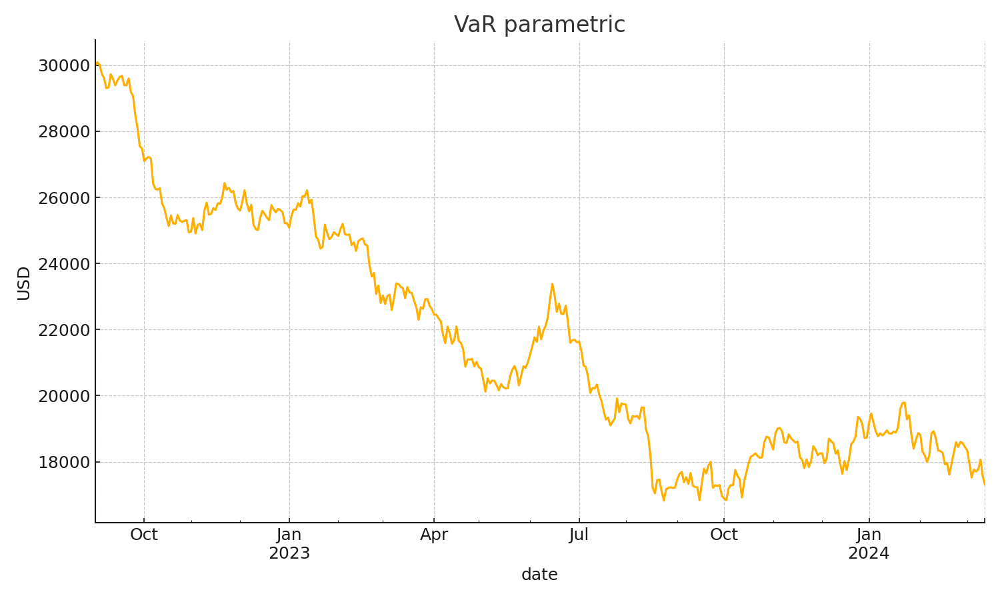
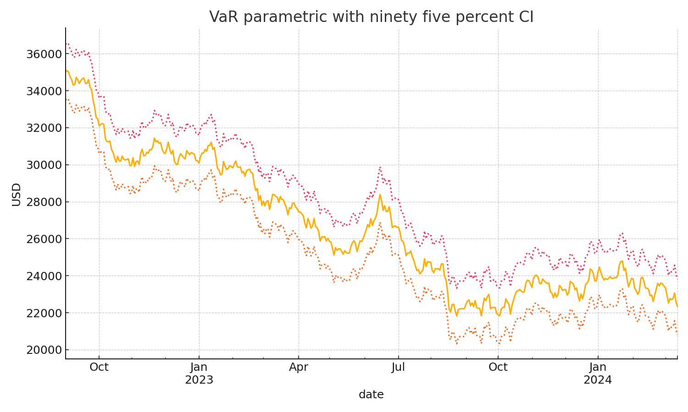
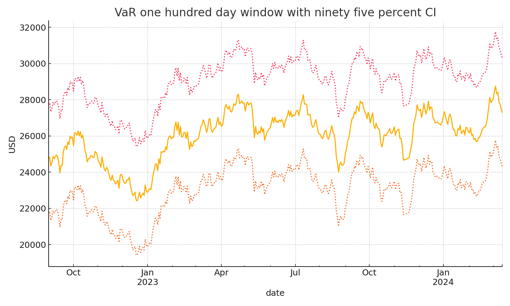
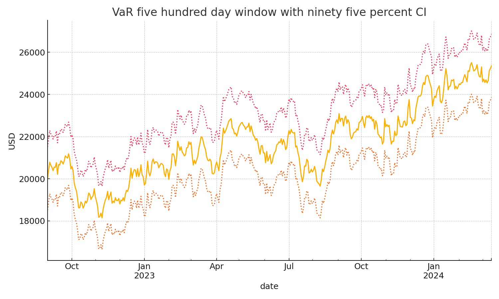
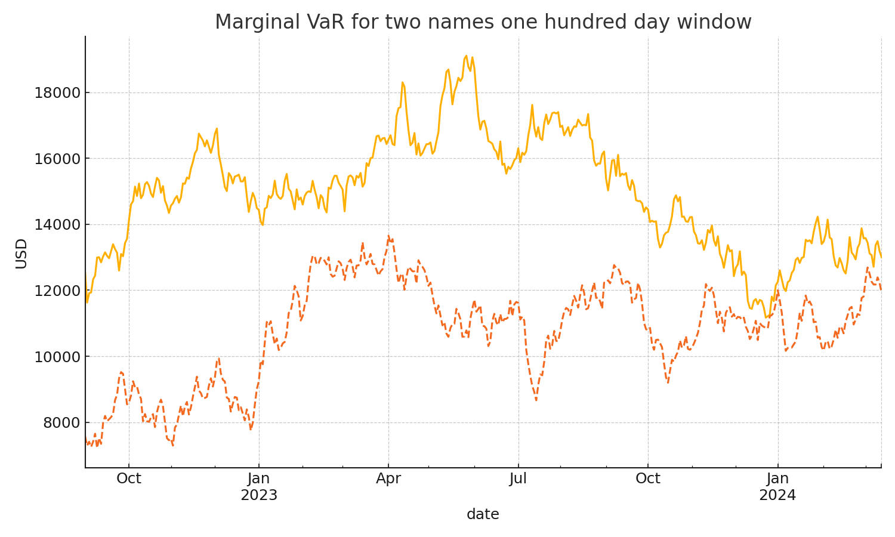

# Rolling VaR engines and backtesting for an equal weight US equity sleeve

I built a compact risk research pipeline for a ten million dollar equal weight US equity sleeve. It estimates one day risk using parametric and historical engines, adds bootstrap confidence bands, and backtests exception rates.

## Summary
I form daily portfolio returns from adjusted prices with adaptive weights when names have gaps. Parametric VaR uses rolling sample mean and covariance. Historical VaR uses a rolling empirical quantile of portfolio returns. Bootstrap intervals use percentile resampling of the window. Backtesting compares realized losses against the latest forecast to count exceptions over a recent evaluation window.

## What this demonstrates
1. Practical portfolio construction and careful data handling  
2. Two complementary VaR engines with marginal attribution  
3. Uncertainty quantification through bootstrap confidence bands  
4. Transparent calibration checks via an exception rate backtest  

## Data and universe
By default I use public daily prices through yfinance. If WRDS credentials are present the code will pull CRSP data first and fall back to public prices if needed. The default universe is GME PAG TTC KRTX OLPX RRC FND MANH WSC and PSTG with equal weights.

## Quick setup
Run one command in a clean environment
```
pip install numpy pandas matplotlib scipy tqdm yfinance
```

## Reproduce a full run
The runner avoids module flags so the command is simple
```
python run.py 20190101 20250801 20220901
```
Arguments are start end and forecast_start as YYYYMMDD. The script writes csv files to output and png figures to figures.

## Key outputs
1. output/q2_VaR_param.csv  
2. output/q3_VaR_hs_100.csv and output/q6_VaR_hs_500.csv  
3. output/q4_mvar_A_100.csv and output/q4_mvar_B_100.csv with the five hundred day versions  
4. output/q5_ci_param.csv plus output/q5_ci_hs100.csv and output/q6_ci_hs500.csv  
5. output/q7_backtest_fixed.csv  

## Results at a glance
The backtest over the last five hundred trading days before the evaluation date shows exception counts that illustrate calibration
```
parametric exceptions 0 and rate 0.000
hs_100 exceptions 75 and rate 0.150
hs_500 exceptions 25 and rate 0.050
```
These figures match my original Berkeley run of this project.

## Selected figures
The repo ships with small preview figures so the README renders nicely on first view. When you run the pipeline these will be replaced by fresh plots from real data.






## Configuration
1. Portfolio value through environment variable PORTFOLIO_VALUE and default ten million  
2. Confidence level through environment variable ALPHA and default ninety five percent  
3. Windows through environment variables WINDOW_SHORT and WINDOW_LONG with defaults one hundred and five hundred  
4. Universe through environment variable TICKERS as a comma separated list  

## Method notes
Parametric VaR computes rolling mean and covariance and uses the normal quantile on the portfolio mean and variance. Historical VaR is a rolling quantile of realized portfolio returns. Bootstrap intervals resample the estimation window and rebuild the estimator for each draw.

## Why I built this
I first explored the idea during my time at UC Berkeley and shaped it into this project repo. 

